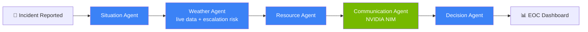

<div align="center">

# 🛡️ SentinelAI

### AI-Powered Emergency Intelligence Platform

**A real multi-agent system that thinks like an Emergency Operations Center — not a chatbot.**

[](https://www.python.org/)
[](https://fastapi.tiangolo.com/)
[](https://nextjs.org/)
[](https://www.typescriptlang.org/)
[](https://google.github.io/adk-docs/)
[](https://build.nvidia.com/)
[](LICENSE)

Built for **Gen AI Academy — Cohort 2 Hackathon**, Challenge Track 2: *Autonomous Multi-Agent Systems*, sponsored by NVIDIA.

</div>

---

## 📖 Overview

When a disaster strikes, an Emergency Operations Center (EOC) has minutes to answer five questions at once: *What happened? How bad is it? Will the weather make it worse? What resources do we send? What do we tell the public?*

**SentinelAI** answers all five simultaneously, using five specialized autonomous AI agents — orchestrated with **Google's Agent Development Kit (ADK)** — that reason over a reported incident, pull live weather data, estimate responder resources, draft public communications, and converge on a single, confidence-scored action plan. It's not a Q&A chatbot; it's a decision-support dashboard designed to look and feel like software an EOC commander would actually trust.

## 🎯 The Problem

Emergency responders currently synthesize situation reports, weather forecasts, resource logistics, and public messaging manually, under time pressure, across disconnected tools. SentinelAI collapses that into a single pipeline: report an incident once, and five coordinated agents hand off structured findings to each other automatically — from raw description to a final, prioritized action plan.

## 🧠 How It Works — The Agent Pipeline



All five agents are orchestrated as a real `google.adk.agents.SequentialAgent`, sharing one ADK session — each agent reads the prior agents' structured output directly from session state, no manual glue code required.

| # | Agent | Responsibility | Model |
|---|-------|-----------------|-------|
| 1 | **Situation Agent** | Classifies disaster type, estimates severity & risk score, summarizes hazards | Gemini 2.5 Flash |
| 2 | **Weather Agent** | Calls a live OpenWeather tool, then reasons about escalation risk | Gemini 2.5 Flash (tool-calling) |
| 3 | **Resource Agent** | Estimates ambulances, rescue teams, shelters, medical kits, food supplies | Gemini 2.5 Flash |
| 4 | **Communication Agent** | Drafts a public alert, SMS, email, and press release | NVIDIA NIM (Llama 3.1) |
| 5 | **Decision Agent** | Synthesizes everything into a final, confidence-scored action plan | Gemini 2.5 Flash |

## ✨ Features

- 🤖 **Real multi-agent orchestration** — genuine `SequentialAgent` + `LlmAgent` from Google ADK, not simulated logic
- 🌦️ **Live weather grounding** — an agent actually calls a tool that hits the OpenWeather API in real time
- 🖥️ **Full EOC-style dashboard** — incident overview, severity badges, agent status timeline, resource breakdown, confidence meter
- 🔀 **Multi-provider inference** — Gemini for reasoning agents, NVIDIA NIM for public communications, demonstrating genuine cross-provider orchestration
- 📊 **Structured, typed outputs** — every agent response is schema-validated with Pydantic before it ever reaches the frontend
- ⚡ **Graceful degradation** — missing weather/NIM keys don't crash the pipeline; agents reason around missing data instead
- 🌓 **Dark, professional UI** — built with Next.js 15, TypeScript, and Tailwind CSS

## 🏗️ Tech Stack

| Layer | Technology |
|---|---|
| Frontend | Next.js 15 · TypeScript · Tailwind CSS · Axios |
| Backend | Python · FastAPI · Pydantic |
| AI Orchestration | Google Agent Development Kit (ADK) · Gemini 2.5 Flash |
| Multi-Provider Inference | NVIDIA NIM (via ADK's LiteLLM model wrapper) |
| Live Data | OpenWeather API |
| Deployment | Vercel (frontend) · Render (backend) |

## 🚀 Getting Started

### Prerequisites
- Python 3.12+
- Node.js 18+
- API keys: [Google AI Studio](https://ai.google.dev/gemini-api/docs/api-key) (free), [NVIDIA build.nvidia.com](https://build.nvidia.com/) (free), [OpenWeather](https://openweathermap.org/api) (free)

### Backend
```bash
cd backend
python -m venv venv
source venv/bin/activate        # Windows: venv\Scripts\activate
pip install -r requirements.txt
cp .env.example .env            # then fill in your API keys
uvicorn app:app --reload --port 8000
```

### Frontend
```bash
cd frontend
npm install
cp .env.local.example .env.local
npm run dev
```

Open **http://localhost:3000**, report an incident, and watch all five agents run live.

### Environment Variables

| Variable | Where | Required | Notes |
|---|---|---|---|
| `GOOGLE_API_KEY` | backend | Yes | Powers all Gemini-backed agents |
| `NVIDIA_API_KEY` | backend | Optional | Falls back to Gemini if unset |
| `OPENWEATHER_API_KEY` | backend | Optional | Falls back to reasoned estimate if unset |
| `ALLOWED_ORIGINS` | backend | Yes | Comma-separated frontend origin(s) for CORS |
| `NEXT_PUBLIC_API_BASE_URL` | frontend | Yes | URL of the running backend |

## 📡 API

| Method | Endpoint | Description |
|---|---|---|
| `GET` | `/health` | Service + integration status check |
| `POST` | `/api/incidents` | Runs the full 5-agent pipeline on a reported incident |

Interactive API docs available at `/docs` when the backend is running.

## 📁 Project Structure

```
sentinelai/
├── backend/
│   ├── app.py              # FastAPI entrypoint
│   ├── adk_agents.py       # Google ADK agent + pipeline definitions
│   ├── agent_manager.py    # ADK Runner/Session orchestration
│   ├── models.py           # Pydantic schemas (shared contract with frontend)
│   ├── weather.py          # OpenWeather integration
│   ├── config.py           # Settings management
│   └── render.yaml         # Render deployment blueprint
└── frontend/
    ├── app/                # Next.js App Router pages
    ├── components/         # Dashboard UI components
    ├── services/           # API client layer
    └── types/               # TypeScript types mirroring backend schemas
```

## 🗺️ Roadmap

- [ ] Persistent incident history via ADK's `DatabaseSessionService`
- [ ] Parallelized independent agent branches for lower latency
- [ ] Map-based incident visualization
- [ ] Multi-incident, real-time EOC command view

## 🤝 Contributing

Issues and PRs are welcome — this started as a hackathon build and is actively evolving.

## 📄 License

Released under the [MIT License](LICENSE).

## 🙏 Acknowledgments

Built for the **Gen AI Academy Cohort 2 Hackathon**, Challenge Track 2 (Autonomous Multi-Agent Systems), sponsored by **NVIDIA**. Powered by Google's Agent Development Kit, Gemini, and NVIDIA NIM.
